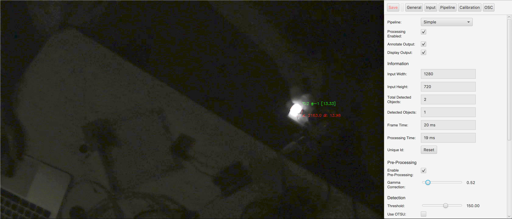

# Touch Table IR Tracking System [](https://travis-ci.org/IAD-ZHDK/IR_tracking)
This project aims to create an infrared tracking system for tactile tables.


*Tracking application detecting a single tactile object.*

### Installation

#### MacOS

Just copy and past this snippet in the terminal to quickly install and start the system (only MacOS).

```bash
echo IR Tracking Quickstart

if [[ $? != 0 ]] ; then
	echo isntalling Homebrew
	ruby -e "$(curl -fsSL https://raw.githubusercontent.com/Homebrew/install/master/install)"
else
	echo Homebrew already installed!
	brew update
fi

brew install git
brew install --cask temurin

git clone https://github.com/IAD-ZHDK/IR_tracking
cd IR_tracking

echo starting...
./gradlew run

echo done
```

After the first time installation, please change into the installation folder and only run the following in the terminal:

```bash
./gradlew run
```

#### Windows

On Windows follow these steps to install the software:

```bash
# install Eclipse Temurin 17 (JDK)
winget install -e --id EclipseAdoptium.Temurin.17.JDK

# run software
gradlew.bat run
```

### Develop

#### Install and Run
Everything is installed through the [gradle](https://gradle.org/) dependency manager. To run the application, OpenJDK 11 is needed and can be installed through your favourite package manager. On MacOS we recommend to use [brew](https://brew.sh/):

```bash
brew install --cask temurin

winget install -e --id EclipseAdoptium.Temurin.17.JDK
```

Now just run the following command and gradlew will download, build and run the project.

```bash
# windows
gradlew.bat run

# macOS / unix
./gradlew run
```

### Build for Distribution
To bundle all dependencies and build the project run the following commands. This will take a bit of time because JavaCV will be added to the jar-file.

```bash
# windows
gradlew.bat clean build jpackage --info

# macOS / unix
./gradlew clean build jpackage --info
```

The built distributable can be found under `build/dist` and includes the JVM as well as all dependencies.

### How to use

#### Example
To connect with the IR tracking system it is possible to listen to predefined OSC messages. There is already a `TrackingClient` written for Processing to connect with the tracking application. Check out the [ExampleReceiver](https://github.com/IAD-ZHDK/IR_tracking/tree/master/examples/ExampleReceiver) sketch.

#### OSC Protocol
The OSC protocol sends out events which are need for the visualisation. It already normalizes and filters the values.

```java
// Add is sent if a new object is detected.

"/tracker/add"
	- uniqueId (int) // unique number
	- identifier (int) // object type
	- x-coordinate (float) // normalized
	- y-coordinate (float) // normalized
	- rotation (float) // between 0.0-180.0
	- intensity (float) // normalized
```


```java
// Every n millisecond an update is sent for each active object.

"/tracker/update"
	- uniqueId (int) // unique number
	- identifier (int) // object type
	- x-coordinate (float) // normalized
	- y-coordinate (float) // normalized
	- rotation (float) // between 0.0-180.0
	- intensity (float) // normalized
```

```java
// Remove is sent if an object is not detected anymore.

"/tracker/remove"
	- uniqueId (int) // unique number
```

### About
Developed at [Zurich University of the Arts ZHdK](https://www.zhdk.ch/) 2022
