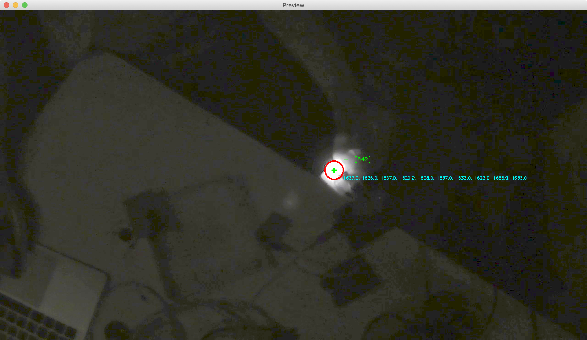

# IR Tracking System
This project aims to create an infrared tracking system for tactile tables.



### Install
Everything is installed through the gradle dependency manager. Just run the following command and gradlew will download, build and run the project.

```bash
# windows
gradle.bat run

# macOS / unix
./gradlew run
```

### Build for Distribution
To bundle all dependencies and build the project run the following commands. This will take a bit of time because JavaCV will be added to the jar-file.

```bash
# windows
gradle.bat fatJar

# macOS / unix
./gradlew fatJar
```
